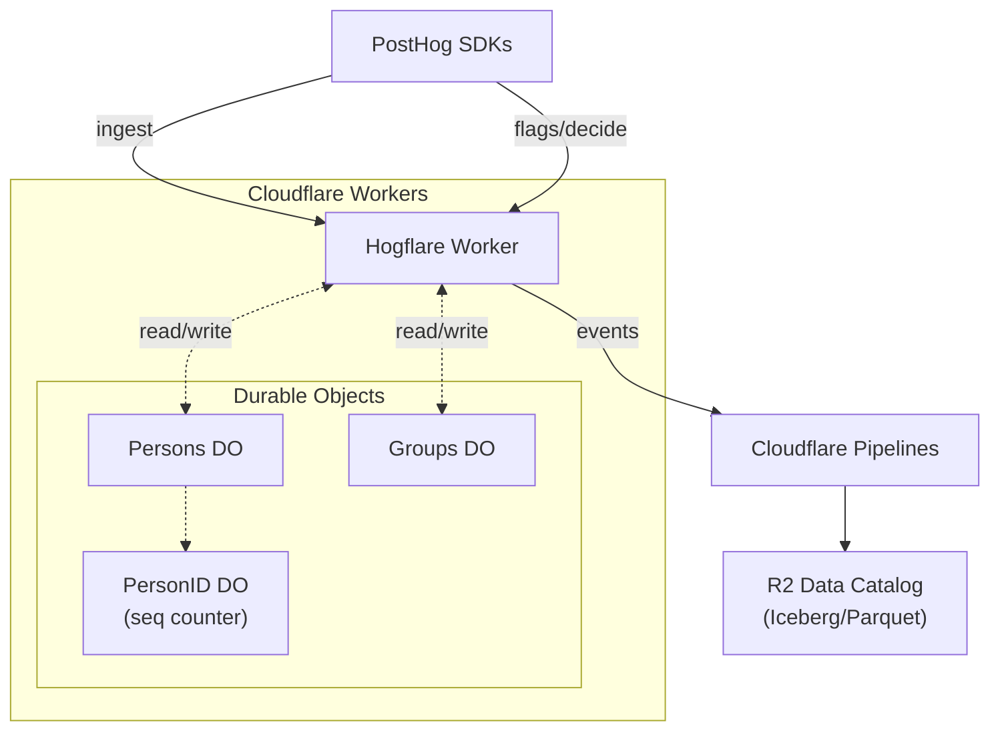

# Hogflare


Hogflare is a Cloudflare Workers ingestion layer for PostHog SDKs. It supports PostHog-style ingestion, stateful persons/groups, and SDK feature flags, then streams events into Cloudflare Pipelines so data lands in R2 as Iceberg/Parquet.

#### What works today

- Ingestion endpoints: `/capture`, `/identify`, `/alias`, `/batch`, `/e`, `/engage`, `/groups`
- Persons and groups: `$set`, `$set_once`, `$unset`, aliasing, and group properties
- Feature flags: `/flags` and `/decide` are evaluated in the Worker (used by PostHog SDKs)
- Request enrichment: Cloudflare IP/geo fields added when missing

## Architecture



## Why?

PostHog is a nice-to-use web & product analytics platform. However, self-hosting PostHog is prohibitively complex so most users seem to rely on the cloud offering. This is an alternative for cost-conscious data folks & businesses interested in a low maintenance way to ingest web & product analytics directly into a managed data lake.

A [hobby deployment of PostHog](https://github.com/PostHog/posthog/blob/master/docker-compose.hobby.yml) includes: postgres, redis, redis7, clickhouse, zookeeper, kafka, worker, web, plugins, proxy, objectstorage, seaweedfs, asyncmigrationscheck, temporal, elasticsearch, temporal-admin-tools, temporal-ui, temporal-django-worker, cyclotron-janitor, capture, replay-capture, property-defs-rs, livestream, feature-flags, cymbal

Admittedly, PostHog does a *lot* more than this package, but some folks really just want the basics!

## Quick start (Cloudflare)

1) Create a Pipeline stream and sink in the Cloudflare dashboard or via `wrangler pipelines setup`.
2) Use the schema below for the stream.
3) Copy `wrangler.toml.example` to `wrangler.toml` and set variables.
4) Set Wrangler secrets.
5) Deploy the Worker.

### Pipeline schema (JSON)

```json
{
  "fields": [
    { "name": "uuid", "type": "string", "required": true },
    { "name": "team_id", "type": "int64", "required": false },
    { "name": "source", "type": "string", "required": true },
    { "name": "event", "type": "string", "required": true },
    { "name": "distinct_id", "type": "string", "required": true },
    { "name": "timestamp", "type": "timestamp", "required": false },
    { "name": "created_at", "type": "timestamp", "required": true },
    { "name": "properties", "type": "json", "required": false },
    { "name": "context", "type": "json", "required": false },
    { "name": "person_id", "type": "string", "required": false },
    { "name": "person_created_at", "type": "timestamp", "required": false },
    { "name": "person_properties", "type": "json", "required": false },
    { "name": "group0", "type": "string", "required": false },
    { "name": "group1", "type": "string", "required": false },
    { "name": "group2", "type": "string", "required": false },
    { "name": "group3", "type": "string", "required": false },
    { "name": "group4", "type": "string", "required": false },
    { "name": "group_properties", "type": "json", "required": false },
    { "name": "api_key", "type": "string", "required": false },
    { "name": "extra", "type": "json", "required": false }
  ]
}
```

### Wrangler config

Copy the example and fill in your stream endpoint:

```bash
cp wrangler.toml.example wrangler.toml
```

```toml
name = "hogflare"
main = "build/index.js" # generated entrypoint from worker-build for the Rust worker
compatibility_date = "2025-01-09"

[vars]
CLOUDFLARE_PIPELINE_ENDPOINT = "https://<stream-id>.ingest.cloudflare.com"
CLOUDFLARE_PIPELINE_TIMEOUT_SECS = "10"

# Optional
# POSTHOG_TEAM_ID = "1"
# POSTHOG_GROUP_TYPE_0 = "company"
# POSTHOG_GROUP_TYPE_1 = "team"
# POSTHOG_GROUP_TYPE_2 = "project"
# POSTHOG_GROUP_TYPE_3 = "org"
# POSTHOG_GROUP_TYPE_4 = "workspace"

[[durable_objects.bindings]]
name = "PERSONS"
class_name = "PersonDurableObject"

[[durable_objects.bindings]]
name = "PERSON_ID_COUNTER"
class_name = "PersonIdCounterDurableObject"

[[durable_objects.bindings]]
name = "GROUPS"
class_name = "GroupDurableObject"

[[migrations]]
tag = "v1"
new_classes = ["PersonDurableObject"]

[[migrations]]
tag = "v2"
new_classes = ["PersonIdCounterDurableObject", "GroupDurableObject"]
```

### Secrets

```bash
bunx wrangler secret put CLOUDFLARE_PIPELINE_AUTH_TOKEN
bunx wrangler secret put POSTHOG_SIGNING_SECRET
```

### Deploy

```bash
bunx wrangler deploy
```

## Send a test event

```bash
curl -X POST https://<your-worker>.workers.dev/capture \
  -H "Content-Type: application/json" \
  -d '[
    {
      "api_key": "phc_example",
      "event": "purchase",
      "distinct_id": "user_12345",
      "properties": { "amount": 29.99, "product_id": "widget-001" }
    }
  ]'
```

## HMAC signing (optional)

If `POSTHOG_SIGNING_SECRET` is set, requests must include a valid signature.

```bash
payload='[
  {
    "api_key": "phc_example",
    "event": "purchase",
    "distinct_id": "user_12345",
    "properties": { "amount": 29.99 }
  }
]'

signature=$(printf '%s' "$payload" | openssl dgst -sha256 -hmac "$POSTHOG_SIGNING_SECRET" | awk '{print $2}')

curl -X POST https://<your-worker>.workers.dev/capture \
  -H "Content-Type: application/json" \
  -H "X-POSTHOG-SIGNATURE: sha256=$signature" \
  -d "$payload"
```

Note: `X-HUB-SIGNATURE` with `sha1=` is also accepted for GitHub-style webhook compatibility.

## PostHog SDK config

### Browser (posthog-js)

```js
import posthog from "posthog-js";

posthog.init("<project_api_key>", {
  api_host: "https://<your-worker>.workers.dev",
  capture_pageview: true,
});
```

### Server (posthog-node)

```js
import { PostHog } from "posthog-node";

const client = new PostHog("<project_api_key>", {
  host: "https://<your-worker>.workers.dev",
});

client.capture({
  distinctId: "user_123",
  event: "purchase",
  properties: { amount: 29.99 },
});

await client.shutdown();
```

### Other SDKs

Set the SDK host/base URL to your Worker (`https://<your-worker>.workers.dev`) and use your project API key. Most SDKs use either `api_host` (browser/mobile) or `host` (server).

## Local development (fake pipeline)

The repo includes a lightweight fake pipeline (FastAPI + DuckDB) used by tests.

```bash
docker compose up --build -d fake-pipeline
```

```bash
# .env.local (not committed)
CLOUDFLARE_PIPELINE_ENDPOINT=http://127.0.0.1:8088/
CLOUDFLARE_PIPELINE_TIMEOUT_SECS=5
```

```bash
cargo run
```

## Query data (DuckDB)

```sql
INSTALL httpfs;
INSTALL iceberg;
LOAD httpfs;
LOAD iceberg;

CREATE SECRET r2_catalog_secret (
  TYPE ICEBERG,
  TOKEN '<CLOUDFLARE_API_TOKEN>'
);

ATTACH '<ACCOUNT_ID>_<BUCKET>' AS iceberg_catalog (
  TYPE ICEBERG,
  ENDPOINT 'https://catalog.cloudflarestorage.com/<ACCOUNT_ID>/<BUCKET>'
);

SELECT count(*) FROM iceberg_catalog.default.hogflare;
SELECT * FROM iceberg_catalog.default.hogflare LIMIT 5;
```

## PostHog compatibility

### Ingestion endpoints

- `/capture` (single or batch payloads)
- `/identify`
- `/alias`
- `/batch` (mixed events)
- `/e` (event payloads)
- `/engage`
- `/groups`

### Persons

Identify, capture `$set` / `$set_once` / `$unset`, and alias events update a person record stored in a Durable Object. The record tracks distinct_id aliases, person properties, and a sequential `id` plus a UUID. Events include:

- `person_id` (the person UUID)
- `person_created_at`
- `person_properties`

Person DO state is not written to R2. Only event-level snapshots are stored in the pipeline sink.

### Groups

- `/groups` (`$groupidentify` payloads) are forwarded.
- Group properties are stored in a Group DO and attached to events as `group_properties`.
- Group slots (`group0`..`group4`) are mapped by `POSTHOG_GROUP_TYPE_0..4`.

### Session replay

- `/s` stores raw session recording chunks only.

### Feature flags

Feature flags are evaluated in the Worker and exposed via `/decide` and `/flags`.

Configuration is a JSON blob in `HOGFLARE_FEATURE_FLAGS`. It can be either:

- `{ "flags": [ ... ] }`
- `[ ... ]` (array of flag definitions)

Supported fields per flag:

| Field | Type | Notes |
| --- | --- | --- |
| `key` | string | Flag key |
| `active` | bool | Defaults to `true` |
| `type` | `"boolean"` \| `"multivariate"` | Defaults to boolean |
| `rollout_percentage` | number | 0–100 |
| `variants` | array | `[{ key, rollout_percentage, payload? }]` |
| `payload` | json | Used for boolean flags |
| `variant_payloads` | map | `{ "variant_key": { ... } }` |
| `conditions` | array | See filters below |
| `group_type` | string | Enables group-based rollout |
| `evaluation_environments` | array | Optional env gating |
| `salt` | string | Optional bucketing salt |
| `id`, `version`, `description` | metadata | Returned in flag details |

Filters support these operators:

- `eq` (default), `is_not`
- `in`, `not_in`
- `contains`
- `regex`
- `is_set`
- `gt`, `gte`, `lt`, `lte`

Value comparisons coerce strings/booleans/numbers when possible (e.g. `"21"` >= `18`).

Request fields honored by `/flags` and `/decide`:

- `flag_keys_to_evaluate` — only evaluate these keys
- `evaluation_environments` — only evaluate flags whose `evaluation_environments` includes one of these
- `person_properties`, `group_properties`, `groups` — override state for evaluation

#### Bucketing

Rollout bucketing is deterministic:

- Hash: `sha1("{salt}:{hash_id}")`
- `hash_id` is `distinct_id` for person flags, or the group key when `group_type` is set
- Bucket = `hash % 100` (0–99)
- `salt` defaults to the flag `key` if not provided

Example:

```json
{
  "flags": [
    {
      "key": "pro-flag",
      "active": true,
      "rollout_percentage": 100,
      "id": 12,
      "version": 3,
      "description": "Pro users",
      "salt": "pro-flag-salt",
      "conditions": [
        {
          "properties": [
            { "key": "plan", "value": ["pro", "enterprise"], "operator": "in" },
            { "key": "age", "value": 18, "operator": "gte" }
          ]
        }
      ],
      "payload": { "tier": "pro" }
    }
  ]
}
```

Limitations: cohorts and event-based filters are not supported.

### Signing

- If `POSTHOG_SIGNING_SECRET` is set, requests must include a valid HMAC signature.

### Enrichment

Hogflare adds Cloudflare request data into `properties` when those keys are not already present:

- `$ip` from `CF-Connecting-IP`
- `$geoip_*` from Cloudflare request metadata (country, city, region, lat/long, timezone)
- `cf_*` fields: `cf_asn`, `cf_as_organization`, `cf_colo`, `cf_metro_code`, `cf_ray`

## Event shape in R2

Each row is a `PipelineEvent` with these columns:

| Field | Type / Notes |
| --- | --- |
| `uuid` | string (UUID v4) |
| `team_id` | int64 (optional) |
| `source` | string |
| `event` | string |
| `distinct_id` | string |
| `timestamp` | RFC3339 timestamp (optional) |
| `created_at` | RFC3339 timestamp |
| `properties` | JSON |
| `context` | JSON |
| `person_id` | string (person UUID) |
| `person_created_at` | RFC3339 timestamp |
| `person_properties` | JSON |
| `group0..group4` | string (group key slots) |
| `group_properties` | JSON (by group type) |
| `api_key` | string |
| `extra` | JSON |
