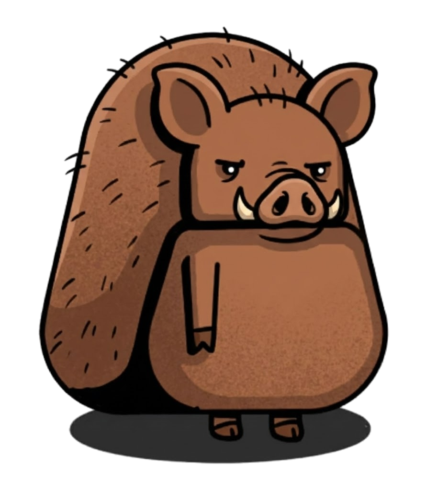
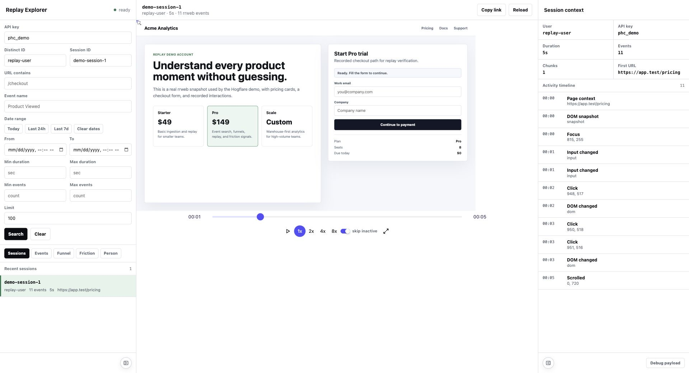
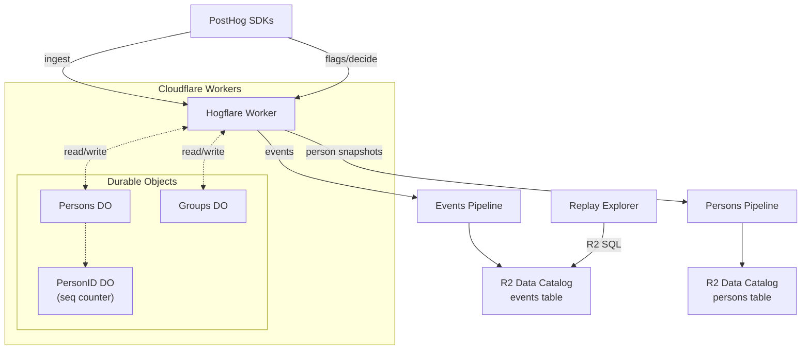

# Hogflare



Hogflare is a Cloudflare Workers ingestion layer for PostHog SDKs. It supports PostHog-style ingestion, stateful persons and groups, SDK feature flags, and a read-only session replay explorer, then streams events and person snapshots into Cloudflare Pipelines so data lands in R2 as Iceberg/Parquet.



## What Works Today

- PostHog-compatible ingestion endpoints: `/capture`, `/identify`, `/alias`, `/batch`, `/e`, `/engage`, `/groups`, `/s`
- Persons and groups: `$set`, `$set_once`, `$unset`, aliasing, group properties, and group slots
- SDK config and feature flags: `/array/:token/config`, `/flags`, and `/decide`
- Session replay ingestion and read-only replay explorer backed by R2 SQL over Iceberg rows
- Request enrichment with Cloudflare IP and geo fields
- Queryable event and person snapshots in R2 Data Catalog-backed Iceberg tables

## Docs

- [Deployment](docs/deployment.md): Cloudflare Pipeline setup, Wrangler config, secrets, deployment, verification, local fake pipeline, and cleanup.
- [Session Replay](docs/session-replay.md): replay ingestion, explorer UI, API routes, filters, and local demo commands.
- [PostHog Compatibility](docs/posthog-compatibility.md): SDK setup, endpoint behavior, persons, groups, feature flags, signing, and enrichment.
- [Import Existing PostHog Data](docs/import-posthog.md): host-side backfill importer for existing PostHog projects.
- [Data Model](docs/data-model.md): event and person row shapes plus DuckDB/R2 SQL query examples.

## Architecture


```mermaid
flowchart TB
    SDKs["PostHog SDKs"]

    SDKs -->|"ingest"| Worker
    SDKs -->|"flags/decide"| Worker

    subgraph CF["Cloudflare Workers"]
        Worker["Hogflare Worker"]

        subgraph DOs["Durable Objects"]
            PersonsDO["Persons DO"]
            PersonIdDO["PersonID DO<br/>(seq counter)"]
            GroupsDO["Groups DO"]
        end

        Worker <-.->|"read/write"| PersonsDO
        Worker <-.->|"read/write"| GroupsDO
        PersonsDO -.-> PersonIdDO
    end

    Worker -->|"events"| EventsPipeline["Events Pipeline"]
    Worker -->|"person snapshots"| PersonsPipeline["Persons Pipeline"]
    EventsPipeline --> EventsR2["R2 Data Catalog<br/>events table"]
    PersonsPipeline --> PersonsR2["R2 Data Catalog<br/>persons table"]

    ReplayUI["Replay Explorer"] -->|"R2 SQL"| EventsR2
```

## Why

PostHog is a nice-to-use web and product analytics platform. Self-hosting PostHog is prohibitively complex, so most users rely on the cloud offering. Hogflare is an alternative for cost-conscious data teams and businesses that want a low-maintenance way to ingest web and product analytics directly into a managed data lake.

A [hobby deployment of PostHog](https://github.com/PostHog/posthog/blob/master/docker-compose.hobby.yml) includes postgres, redis, redis7, clickhouse, zookeeper, kafka, worker, web, plugins, proxy, objectstorage, seaweedfs, asyncmigrationscheck, temporal, elasticsearch, temporal-admin-tools, temporal-ui, temporal-django-worker, cyclotron-janitor, capture, replay-capture, property-defs-rs, livestream, feature-flags, and cymbal.

PostHog does much more than this package, but some teams only need the warehouse-first basics.

## Replay Demo

The branch includes a local replay fixture that makes the explorer usable without Cloudflare credentials:

```bash
REPLAY_DEMO_PORT=4666 bun scripts/replay_demo_stub.mjs
```

```bash
APP_ADDR=127.0.0.1:4567 \
CLOUDFLARE_PIPELINE_ENDPOINT=http://127.0.0.1:4666/ \
HOGFLARE_REPLAY_ACCOUNT_ID=demo-account \
HOGFLARE_REPLAY_BUCKET=demo-bucket \
HOGFLARE_REPLAY_R2_SQL_TOKEN=demo-token \
HOGFLARE_REPLAY_R2_SQL_ENDPOINT=http://127.0.0.1:4666/ \
HOGFLARE_REPLAY_EVENTS_TABLE=default.hogflare_events \
HOGFLARE_REPLAY_QUERY_LIMIT=500 \
cargo run --bin hogflare
```

Open:

```text
http://127.0.0.1:4567/replay?api_key=phc_demo&distinct_id=replay-user&limit=100&session_id=demo-session-1&at_ms=1500
```
