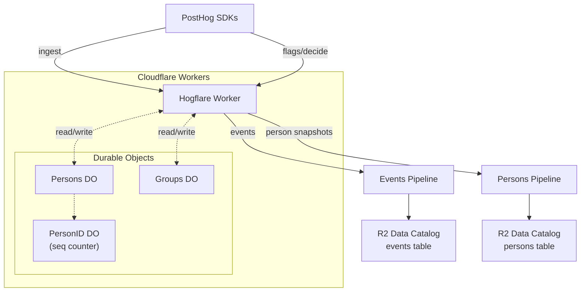

# Hogflare


Hogflare is a Cloudflare Workers ingestion layer for PostHog SDKs. It supports PostHog-style ingestion, stateful persons/groups, and SDK feature flags, then streams events and person snapshots into Cloudflare Pipelines so data lands in R2 as Iceberg/Parquet.

#### What works today

- Ingestion endpoints: `/capture`, `/identify`, `/alias`, `/batch`, `/e`, `/engage`, `/groups`
- Persons and groups: `$set`, `$set_once`, `$unset`, aliasing, and group properties
- Feature flags: `/flags` and `/decide` are evaluated in the Worker (used by PostHog SDKs)
- Request enrichment: Cloudflare IP/geo fields added when missing
- Queryable people: append-only person snapshots can be written to a separate Iceberg table

## Architecture


```mermaid
flowchart TB
    SDKs["PostHog SDKs"]

    SDKs -->|"ingest"| Worker
    SDKs -->|"flags/decide"| Worker

    subgraph CF["Cloudflare Workers"]
        Worker["Hogflare Worker"]

        subgraph DOs["Durable Objects"]
            PersonsDO["Persons DO"]
            PersonIdDO["PersonID DO<br/>(seq counter)"]
            GroupsDO["Groups DO"]
        end

        Worker <-.->|"read/write"| PersonsDO
        Worker <-.->|"read/write"| GroupsDO
        PersonsDO -.-> PersonIdDO
    end

    Worker -->|"events"| EventsPipeline["Events Pipeline"]
    Worker -->|"person snapshots"| PersonsPipeline["Persons Pipeline"]
    EventsPipeline --> EventsR2["R2 Data Catalog<br/>events table"]
    PersonsPipeline --> PersonsR2["R2 Data Catalog<br/>persons table"]
```

## Why?

PostHog is a nice-to-use web & product analytics platform. However, self-hosting PostHog is prohibitively complex so most users seem to rely on the cloud offering. This is an alternative for cost-conscious data folks & businesses interested in a low maintenance way to ingest web & product analytics directly into a managed data lake.

A [hobby deployment of PostHog](https://github.com/PostHog/posthog/blob/master/docker-compose.hobby.yml) includes: postgres, redis, redis7, clickhouse, zookeeper, kafka, worker, web, plugins, proxy, objectstorage, seaweedfs, asyncmigrationscheck, temporal, elasticsearch, temporal-admin-tools, temporal-ui, temporal-django-worker, cyclotron-janitor, capture, replay-capture, property-defs-rs, livestream, feature-flags, cymbal

Admittedly, PostHog does a *lot* more than this package, but some folks really just want the basics!

## Quick start (Cloudflare)

1. Create R2 Data Catalog-backed Pipelines resources.
2. Copy `wrangler.toml.example` to `wrangler.toml` and set the stream endpoints.
3. Set Wrangler secrets.
4. Build and deploy the Worker.
5. Send a capture/identify verification flow and query the Iceberg tables.

The examples below use stable table names for a fresh deployment: `default.hogflare_events` and `default.hogflare_persons`. If you use versioned names during migration, substitute those names consistently in the sink commands and queries.

### Create Pipelines Resources

Set these values before creating sinks:

```bash
export R2_BUCKET="<bucket-name>"
export R2_CATALOG_TOKEN="<r2-data-catalog-token>"
```

`R2_CATALOG_TOKEN` is the token used by R2 Data Catalog/R2 SQL clients such as DuckDB or PyIceberg. The bucket must have R2 Data Catalog enabled before creating `r2-data-catalog` sinks.

Create the events stream, sink, and pipeline:

```bash
bunx wrangler pipelines streams create hogflare_events_stream \
  --schema-file scripts/events-pipeline-schema.json \
  --http-enabled true \
  --http-auth true

bunx wrangler pipelines sinks create hogflare_events_sink \
  --type r2-data-catalog \
  --bucket "$R2_BUCKET" \
  --namespace default \
  --table hogflare_events \
  --catalog-token "$R2_CATALOG_TOKEN" \
  --roll-interval 60

bunx wrangler pipelines create hogflare_events_pipeline \
  --sql "INSERT INTO hogflare_events_sink SELECT * FROM hogflare_events_stream;"
```

Create the persons stream, sink, and pipeline if you want queryable people in Iceberg:

```bash
bunx wrangler pipelines streams create hogflare_persons_stream \
  --schema-file scripts/persons-pipeline-schema.json \
  --http-enabled true \
  --http-auth true

bunx wrangler pipelines sinks create hogflare_persons_sink \
  --type r2-data-catalog \
  --bucket "$R2_BUCKET" \
  --namespace default \
  --table hogflare_persons \
  --catalog-token "$R2_CATALOG_TOKEN" \
  --roll-interval 60

bunx wrangler pipelines create hogflare_persons_pipeline \
  --sql "INSERT INTO hogflare_persons_sink SELECT * FROM hogflare_persons_stream;"
```

Each stream creation command prints an HTTP endpoint like `https://<stream-id>.ingest.cloudflare.com`. Use those endpoints in `wrangler.toml`.

### Wrangler config

Copy the example and fill in the stream endpoints:

```bash
cp wrangler.toml.example wrangler.toml
```

```toml
name = "hogflare"
main = "build/index.js" # generated entrypoint from worker-build for the Rust worker
compatibility_date = "2025-01-09"

[vars]
CLOUDFLARE_PIPELINE_ENDPOINT = "https://<stream-id>.ingest.cloudflare.com"
CLOUDFLARE_PERSONS_PIPELINE_ENDPOINT = "https://<persons-stream-id>.ingest.cloudflare.com"
CLOUDFLARE_PIPELINE_TIMEOUT_SECS = "10"

# Optional
# POSTHOG_TEAM_ID = "1"
# POSTHOG_GROUP_TYPE_0 = "company"
# POSTHOG_GROUP_TYPE_1 = "team"
# POSTHOG_GROUP_TYPE_2 = "project"
# POSTHOG_GROUP_TYPE_3 = "org"
# POSTHOG_GROUP_TYPE_4 = "workspace"

[[durable_objects.bindings]]
name = "PERSONS"
class_name = "PersonDurableObject"

[[durable_objects.bindings]]
name = "PERSON_ID_COUNTER"
class_name = "PersonIdCounterDurableObject"

[[durable_objects.bindings]]
name = "GROUPS"
class_name = "GroupDurableObject"

[[migrations]]
tag = "v1"
new_sqlite_classes = ["PersonDurableObject"]

[[migrations]]
tag = "v2"
new_sqlite_classes = ["PersonIdCounterDurableObject", "GroupDurableObject"]
```

### Configuration Reference

| Setting | Required | Notes |
| --- | --- | --- |
| `CLOUDFLARE_PIPELINE_ENDPOINT` | Yes | Events stream HTTP endpoint from `wrangler pipelines streams create`. |
| `CLOUDFLARE_PIPELINE_AUTH_TOKEN` | Yes, for authenticated streams | Bearer token used for events stream HTTP ingest. |
| `CLOUDFLARE_PERSONS_PIPELINE_ENDPOINT` | No | Persons stream endpoint. Set this to write person snapshots to Iceberg. |
| `CLOUDFLARE_PERSONS_PIPELINE_AUTH_TOKEN` | No | Falls back to `CLOUDFLARE_PIPELINE_AUTH_TOKEN` when omitted. |
| `CLOUDFLARE_PIPELINE_TIMEOUT_SECS` | No | Defaults to 10 seconds. |
| `POSTHOG_API_KEY` | No | Default project token returned by `/decide` when request/header token is absent. |
| `POSTHOG_TEAM_ID` | No | Optional team id attached to event and person rows. |
| `POSTHOG_GROUP_TYPE_0..4` | No | Maps PostHog group types to `group0..group4`; set `POSTHOG_GROUP_TYPE_0=company` to populate `group0` for company groups. |
| `POSTHOG_SESSION_RECORDING_ENDPOINT` | No | Returned in `/decide` session recording config. |
| `POSTHOG_SIGNING_SECRET` | No | Enables HMAC request signature checks. |
| `PERSON_DEBUG_TOKEN` | No | Enables `/__debug/person/:id` for deployment verification. |
| `HOGFLARE_FEATURE_FLAGS` | No | JSON flag config used by `/decide` and `/flags`. |

### Secrets

Use a Cloudflare API token that can write to Pipelines for `CLOUDFLARE_PIPELINE_AUTH_TOKEN`. The same token can usually be reused for the persons stream.

```bash
bunx wrangler secret put CLOUDFLARE_PIPELINE_AUTH_TOKEN
# Optional. If omitted, the persons pipeline uses CLOUDFLARE_PIPELINE_AUTH_TOKEN.
bunx wrangler secret put CLOUDFLARE_PERSONS_PIPELINE_AUTH_TOKEN

# Optional.
bunx wrangler secret put POSTHOG_SIGNING_SECRET
bunx wrangler secret put PERSON_DEBUG_TOKEN
bunx wrangler secret put HOGFLARE_FEATURE_FLAGS
```

### Deploy

```bash
worker-build --release
bunx wrangler deploy
```

## Verify Deployment

```bash
export HOGFLARE_URL="https://<your-worker>.workers.dev"
export HOGFLARE_API_KEY="phc_verify_$(date -u +%Y%m%d%H%M%S)"
export HOGFLARE_ANON_ID="${HOGFLARE_API_KEY}_anon"
export HOGFLARE_USER_ID="${HOGFLARE_API_KEY}_user"
```

Send an anonymous capture:

```bash
curl -X POST "$HOGFLARE_URL/capture" \
  -H "Content-Type: application/json" \
  -d "{
    \"api_key\": \"$HOGFLARE_API_KEY\",
    \"event\": \"verify-anon-capture\",
    \"distinct_id\": \"$HOGFLARE_ANON_ID\",
    \"properties\": {
      \"\$set\": { \"initial_referrer\": \"docs\" },
      \"\$set_once\": { \"first_seen_source\": \"readme\" }
    }
  }"
```

Identify the user and link the anonymous ID:

```bash
curl -X POST "$HOGFLARE_URL/identify" \
  -H "Content-Type: application/json" \
  -d "{
    \"api_key\": \"$HOGFLARE_API_KEY\",
    \"distinct_id\": \"$HOGFLARE_USER_ID\",
    \"properties\": {
      \"\$anon_distinct_id\": \"$HOGFLARE_ANON_ID\",
      \"\$set\": { \"email\": \"verify@example.com\", \"plan\": \"pro\" },
      \"\$set_once\": { \"signup_source\": \"readme\" }
    }
  }"
```

Send a post-identify capture:

```bash
curl -X POST "$HOGFLARE_URL/capture" \
  -H "Content-Type: application/json" \
  -d "{
    \"api_key\": \"$HOGFLARE_API_KEY\",
    \"event\": \"verify-identified-capture\",
    \"distinct_id\": \"$HOGFLARE_USER_ID\",
    \"properties\": { \"button\": \"verify\" }
  }"
```

Wait for the sink roll interval, then query R2 SQL:

```bash
export R2_WAREHOUSE="<account-id>_<bucket-name>"
export WRANGLER_R2_SQL_AUTH_TOKEN="$R2_CATALOG_TOKEN"

bunx wrangler r2 sql query "$R2_WAREHOUSE" \
  "select event, distinct_id, person_id, person_properties
   from default.hogflare_events
   where api_key = '$HOGFLARE_API_KEY'
   order by created_at asc"

bunx wrangler r2 sql query "$R2_WAREHOUSE" \
  "select operation, canonical_distinct_id, person_id, distinct_ids, merged_properties
   from default.hogflare_persons
   where api_key = '$HOGFLARE_API_KEY'
   order by updated_at asc"
```

Expected result: the three event rows share one `person_id`, and the persons table has `capture`, `identify`, `capture` snapshots. After identify, `distinct_ids` should include both the anonymous and identified IDs.

## HMAC signing (optional)

If `POSTHOG_SIGNING_SECRET` is set, requests must include a valid signature.

```bash
payload='[
  {
    "api_key": "phc_example",
    "event": "purchase",
    "distinct_id": "user_12345",
    "properties": { "amount": 29.99 }
  }
]'

signature=$(printf '%s' "$payload" | openssl dgst -sha256 -hmac "$POSTHOG_SIGNING_SECRET" | awk '{print $2}')

curl -X POST https://<your-worker>.workers.dev/capture \
  -H "Content-Type: application/json" \
  -H "X-POSTHOG-SIGNATURE: sha256=$signature" \
  -d "$payload"
```

Note: `X-HUB-SIGNATURE` with `sha1=` is also accepted for GitHub-style webhook compatibility.

## PostHog SDK config

### Browser (posthog-js)

```js
import posthog from "posthog-js";

posthog.init("<project_api_key>", {
  api_host: "https://<your-worker>.workers.dev",
  capture_pageview: true,
});
```

### Server (posthog-node)

```js
import { PostHog } from "posthog-node";

const client = new PostHog("<project_api_key>", {
  host: "https://<your-worker>.workers.dev",
});

client.capture({
  distinctId: "user_123",
  event: "purchase",
  properties: { amount: 29.99 },
});

await client.shutdown();
```

### Other SDKs

Set the SDK host/base URL to your Worker (`https://<your-worker>.workers.dev`) and use your project API key. Most SDKs use either `api_host` (browser/mobile) or `host` (server).

## Local development (fake pipeline)

The repo includes a lightweight fake pipeline (FastAPI + DuckDB) used by tests.

```bash
docker compose up --build -d fake-pipeline
```

```bash
# .env.local (not committed)
CLOUDFLARE_PIPELINE_ENDPOINT=http://127.0.0.1:8088/
CLOUDFLARE_PERSONS_PIPELINE_ENDPOINT=http://127.0.0.1:8088/
CLOUDFLARE_PIPELINE_TIMEOUT_SECS=5
```

```bash
cargo run
```

## Query data (DuckDB)

```sql
INSTALL httpfs;
INSTALL iceberg;
LOAD httpfs;
LOAD iceberg;

CREATE SECRET r2_catalog_secret (
  TYPE ICEBERG,
  TOKEN '<CLOUDFLARE_API_TOKEN>'
);

ATTACH '<ACCOUNT_ID>_<BUCKET>' AS iceberg_catalog (
  TYPE ICEBERG,
  ENDPOINT 'https://catalog.cloudflarestorage.com/<ACCOUNT_ID>/<BUCKET>'
);

SELECT count(*) FROM iceberg_catalog.default.hogflare_events;
SELECT count(*) FROM iceberg_catalog.default.hogflare_persons;
SELECT * FROM iceberg_catalog.default.hogflare_persons LIMIT 5;
```

If you used versioned table names during a migration, substitute those names here.

## Cleanup

Delete Pipelines resources in dependency order: pipelines first, then streams and sinks.

```bash
bunx wrangler pipelines list
bunx wrangler pipelines delete <pipeline-id> --force

bunx wrangler pipelines streams list
bunx wrangler pipelines streams delete <stream-id> --force

bunx wrangler pipelines sinks list
bunx wrangler pipelines sinks delete <sink-id> --force
```

`wrangler r2 sql query` is read-only. To drop an Iceberg table from R2 Data Catalog, use the Iceberg catalog API. One local option is PyIceberg:

```bash
R2_CATALOG_TOKEN="<r2-data-catalog-token>" uv run --with pyiceberg python - <<'PY'
import os
from pyiceberg.catalog.rest import RestCatalog

catalog = RestCatalog(
    name="hogflare",
    warehouse="<account-id>_<bucket-name>",
    uri="https://catalog.cloudflarestorage.com/<account-id>/<bucket-name>",
    token=os.environ["R2_CATALOG_TOKEN"],
)

catalog.drop_table(("default", "<table-name>"), purge_requested=True)
PY
```

## PostHog compatibility

### Ingestion endpoints

- `/capture` (single or batch payloads)
- `/identify`
- `/alias`
- `/batch` (mixed events)
- `/e` (event payloads)
- `/engage`
- `/groups`

### Persons

Identify, capture `$set` / `$set_once` / `$unset`, and alias events update a person record stored in a Durable Object. The record tracks distinct_id aliases, person properties, and a sequential `id` plus a UUID. Events include:

- `person_id` (the person UUID)
- `person_created_at`
- `person_properties`

The Durable Object is the source of truth for the current person record. When `CLOUDFLARE_PERSONS_PIPELINE_ENDPOINT` is configured, Hogflare also writes append-only person snapshots to the persons pipeline so the state is queryable in Iceberg.

### Groups

- `/groups` (`$groupidentify` payloads) are forwarded.
- Group properties are stored in a Group DO and attached to events as `group_properties`.
- Group slots (`group0`..`group4`) are mapped by `POSTHOG_GROUP_TYPE_0..4`.

### Session replay

- `/s` stores raw session recording chunks only.

### Feature flags

Feature flags are evaluated in the Worker and exposed via `/decide` and `/flags`.

Configuration is a JSON blob in `HOGFLARE_FEATURE_FLAGS`. It can be either:

- `{ "flags": [ ... ] }`
- `[ ... ]` (array of flag definitions)

Supported fields per flag:

| Field | Type | Notes |
| --- | --- | --- |
| `key` | string | Flag key |
| `active` | bool | Defaults to `true` |
| `type` | `"boolean"` \| `"multivariate"` | Defaults to boolean |
| `rollout_percentage` | number | 0–100 |
| `variants` | array | `[{ key, rollout_percentage, payload? }]` |
| `payload` | json | Used for boolean flags |
| `variant_payloads` | map | `{ "variant_key": { ... } }` |
| `conditions` | array | See filters below |
| `group_type` | string | Enables group-based rollout |
| `evaluation_environments` | array | Optional env gating |
| `salt` | string | Optional bucketing salt |
| `id`, `version`, `description` | metadata | Returned in flag details |

Filters support these operators:

- `eq` (default), `is_not`
- `in`, `not_in`
- `contains`
- `regex`
- `is_set`
- `gt`, `gte`, `lt`, `lte`

Value comparisons coerce strings/booleans/numbers when possible (e.g. `"21"` >= `18`).

Request fields honored by `/flags` and `/decide`:

- `flag_keys_to_evaluate` — only evaluate these keys
- `evaluation_environments` — only evaluate flags whose `evaluation_environments` includes one of these
- `person_properties`, `group_properties`, `groups` — override state for evaluation

#### Bucketing

Rollout bucketing is deterministic:

- Hash: `sha1("{salt}:{hash_id}")`
- `hash_id` is `distinct_id` for person flags, or the group key when `group_type` is set
- Bucket = `hash % 100` (0–99)
- `salt` defaults to the flag `key` if not provided

Example:

```json
{
  "flags": [
    {
      "key": "pro-flag",
      "active": true,
      "rollout_percentage": 100,
      "id": 12,
      "version": 3,
      "description": "Pro users",
      "salt": "pro-flag-salt",
      "conditions": [
        {
          "properties": [
            { "key": "plan", "value": ["pro", "enterprise"], "operator": "in" },
            { "key": "age", "value": 18, "operator": "gte" }
          ]
        }
      ],
      "payload": { "tier": "pro" }
    }
  ]
}
```

Limitations: cohorts and event-based filters are not supported.

### Signing

- If `POSTHOG_SIGNING_SECRET` is set, requests must include a valid HMAC signature.

### Enrichment

Hogflare adds Cloudflare request data into `properties` when those keys are not already present:

- `$ip` from `CF-Connecting-IP`
- `$geoip_*` from Cloudflare request metadata (country, city, region, lat/long, timezone)
- `cf_*` fields: `cf_asn`, `cf_as_organization`, `cf_colo`, `cf_metro_code`, `cf_ray`

## Event shape in R2

Each row is a `PipelineEvent` with these columns:

| Field | Type / Notes |
| --- | --- |
| `uuid` | string (UUID v4) |
| `team_id` | int64 (optional) |
| `source` | string |
| `event` | string |
| `distinct_id` | string |
| `timestamp` | RFC3339 timestamp (optional) |
| `created_at` | RFC3339 timestamp |
| `properties` | JSON |
| `context` | JSON |
| `person_id` | string (person UUID) |
| `person_created_at` | RFC3339 timestamp |
| `person_properties` | JSON |
| `group0..group4` | string (group key slots) |
| `group_properties` | JSON (by group type) |
| `api_key` | string |
| `extra` | JSON |

## Person shape in R2

Each row is a `PersonPipelineRecord` snapshot with these columns:

| Field | Type / Notes |
| --- | --- |
| `uuid` | string (snapshot UUID v4) |
| `team_id` | int64 (optional) |
| `source` | string |
| `operation` | capture, identify, alias, engage, session_recording |
| `person_id` | string (person UUID) |
| `person_int_id` | int64 |
| `canonical_distinct_id` | string |
| `distinct_ids` | string list / array |
| `created_at` | person creation timestamp |
| `updated_at` | snapshot timestamp |
| `version` | person version |
| `properties` | JSON `$set` properties |
| `properties_set_once` | JSON `$set_once` properties |
| `merged_properties` | JSON merged person properties |
| `api_key` | string |
| `source_event_uuid` | event row UUID that produced the snapshot |
