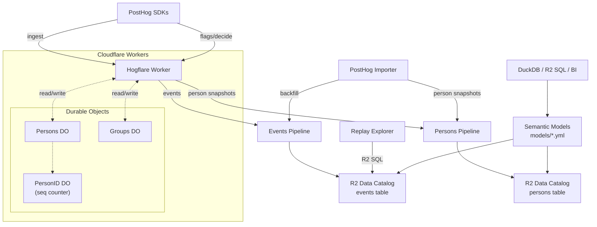

# Hogflare


Hogflare is a warehouse-native PostHog alternative that runs on Cloudflare. Point existing PostHog SDKs at a Worker to capture events, resolve persons and groups, evaluate feature flags, ingest session replay, and write queryable product analytics data to R2 Data Catalog Iceberg tables.

It is built for teams that want PostHog-compatible analytics primitives in their own Cloudflare lakehouse, without operating the full PostHog stack.


## Product Surface

- PostHog-compatible SDK endpoints: `/capture`, `/identify`, `/alias`, `/batch`, `/e`, `/engage`, `/groups`, `/s`
- Stateful persons and groups: `$set`, `$set_once`, `$unset`, aliasing, group properties, group slots, and append-only person snapshots
- Feature flags and remote config: `/array/:token/config`, `/flags`, and `/decide`
- Session replay: PostHog replay ingestion plus an R2 SQL-backed explorer for sessions, event search, funnels, friction signals, and person journeys
- Warehouse output: event rows and person snapshots in R2 Data Catalog-backed Iceberg/Parquet tables
- Cloudflare-native enrichment: IP, geo, colo, ASN, and related request metadata
- Backfill importer for existing PostHog persons, groups, and historical events

## Semantic Model

Hogflare includes semantic model definitions over the R2/Iceberg tables so teams can query product analytics directly from DuckDB, R2 SQL, or BI tooling:

- Core facts: `events`, `sessions`, `pageviews`, `activity_days`
- Identity and profiles: `persons`, `person_profiles`, `identity_links`
- Product analytics: `first_event_retention`, `attribution`, `groups`
- Reusable metrics: identification rate, pageviews per session, events per user, grouped event rate, day 1/7/30 retention, bounce rate, engagement rate, attribution rate, and identity links per profile

## What It Is Not Yet

Hogflare is not a full PostHog clone. It does not try to ship PostHog's complete app surface, plugin system, cohort engine, or ClickHouse-backed query layer. The focus is PostHog SDK compatibility, product analytics data ownership, replay review, and a practical semantic layer on Cloudflare-managed storage.

## Docs

- [Deployment](docs/deployment.md): Cloudflare Pipeline setup, Wrangler config, secrets, deployment, verification, local fake pipeline, and cleanup.
- [Session Replay](docs/session-replay.md): replay ingestion, explorer UI, API routes, filters, and local demo commands.
- [PostHog Compatibility](docs/posthog-compatibility.md): SDK setup, endpoint behavior, persons, groups, feature flags, signing, and enrichment.
- [Import Existing PostHog Data](docs/import-posthog.md): host-side backfill importer for existing PostHog projects.
- [Data Model](docs/data-model.md): event and person row shapes plus DuckDB/R2 SQL query examples.
- [`models/`](models): semantic model definitions for events, sessions, pageviews, persons, identity, groups, attribution, retention, and shared metrics.

## Architecture


```mermaid
flowchart TB
    SDKs["PostHog SDKs"]
    Importer["PostHog Importer"]

    SDKs -->|"ingest"| Worker
    SDKs -->|"flags/decide"| Worker
    Importer -->|"backfill"| EventsPipeline
    Importer -->|"person snapshots"| PersonsPipeline

    subgraph CF["Cloudflare Workers"]
        Worker["Hogflare Worker"]

        subgraph DOs["Durable Objects"]
            PersonsDO["Persons DO"]
            PersonIdDO["PersonID DO<br/>(seq counter)"]
            GroupsDO["Groups DO"]
        end

        Worker <-.->|"read/write"| PersonsDO
        Worker <-.->|"read/write"| GroupsDO
        PersonsDO -.-> PersonIdDO
    end

    Worker -->|"events"| EventsPipeline["Events Pipeline"]
    Worker -->|"person snapshots"| PersonsPipeline["Persons Pipeline"]
    EventsPipeline --> EventsR2["R2 Data Catalog<br/>events table"]
    PersonsPipeline --> PersonsR2["R2 Data Catalog<br/>persons table"]

    ReplayUI["Replay Explorer"] -->|"R2 SQL"| EventsR2
    Models["Semantic Models<br/>models/*.yml"] --> EventsR2
    Models --> PersonsR2
    Consumers["DuckDB / R2 SQL / BI"] --> Models
```

## Why

PostHog is a nice-to-use web and product analytics platform. Self-hosting PostHog is prohibitively complex, so most users rely on the cloud offering. Hogflare is for cost-conscious data teams and businesses that want product analytics, session replay, feature flags, identity resolution, and modeled warehouse data in infrastructure they control.

A [hobby deployment of PostHog](https://github.com/PostHog/posthog/blob/master/docker-compose.hobby.yml) includes postgres, redis, redis7, clickhouse, zookeeper, kafka, worker, web, plugins, proxy, objectstorage, seaweedfs, asyncmigrationscheck, temporal, elasticsearch, temporal-admin-tools, temporal-ui, temporal-django-worker, cyclotron-janitor, capture, replay-capture, property-defs-rs, livestream, feature-flags, and cymbal.

PostHog does much more than Hogflare, but many teams do not need to run PostHog's entire application stack to get useful web and product analytics. Hogflare keeps the SDK integration familiar while making Cloudflare Pipelines, R2 Data Catalog, and Iceberg the system of record.

## Local Replay Demo

The repo includes a local replay fixture that makes the explorer usable without Cloudflare credentials:

```bash
REPLAY_DEMO_PORT=4666 bun scripts/replay_demo_stub.mjs
```

```bash
APP_ADDR=127.0.0.1:4567 \
CLOUDFLARE_PIPELINE_ENDPOINT=http://127.0.0.1:4666/ \
HOGFLARE_REPLAY_ACCOUNT_ID=demo-account \
HOGFLARE_REPLAY_BUCKET=demo-bucket \
HOGFLARE_REPLAY_R2_SQL_TOKEN=demo-token \
HOGFLARE_REPLAY_R2_SQL_ENDPOINT=http://127.0.0.1:4666/ \
HOGFLARE_REPLAY_EVENTS_TABLE=default.hogflare_events \
HOGFLARE_REPLAY_QUERY_LIMIT=500 \
cargo run --bin hogflare
```

Open:

```text
http://127.0.0.1:4567/replay?api_key=phc_demo&distinct_id=replay-user&limit=100&session_id=demo-session-1&at_ms=1500
```
